# UV-K5_upconverter
UV-K5のHF広帯域受信機化改造は，同機のファームウェア変更やハードウェア改造などが行われています．  
現時点(2024/3/28)では，ファームウェア変更により15MHz以上の周波数でSSBの受信が可能となっています．  
UV-K5のFM放送受信用のSDR用ICをSi4732に置換して，HF全領域の受信を可能とする改造もあります．  
AliExpressでは，その改造用部品のキットも販売されています．  

一方，安価なrtl-sdrドングルが流行った頃，初期の段階では30MHz以下では使えなかったため，HF周波数を100MHz程度に周波数変換するアップコンバーターがありました．  
その後，RTL2832Uのダイレクトサンプリングなどの開発により廃れてしまいましたが，今でもアップコンバーターはAmazonやAliExpressなどで見かけます．  
そこで，UV-K5にもアップコンバーターを付けることでHF帯の受信を可能にすることを考えました．  
そうすると．本体の分解なしでHF広帯域受信機化ができます．  

局所発振周波数をF0とすると，周波数fの信号はF0±f (F0>fの時）に変換されます．  
例えば局所発振周波数100MHzで，7MHzのAM信号は107MHzと93MHzに変換され，UV-K5ではどちらの周波数でも受信可能です．  
SSBの場合には，　F0+fに変換された信号の側波帯の符号はそのまま保持され，USBはUSBで，LSBはLSBで復調できます．  
一方，F0-fに変換された信号の場合は，符号が逆転しますので，USBはLSBに，LSBはUSBになります．  
UV-K5のSSBモードは、USBの受信に対応していますので，7MHz帯のUSBを受信したい場合(FT8など)は107MHzで受信する必要があります．  
一方，7MHz帯では音声通信はLSBを使っていますので，例えば7.1MHzの音声信号を受信したい場合，F0-fの92．9MHzで受信すれば，復調できます．  

現在購入できるアップコンバーターは外部電源が必要なものしか見つけられなかったので，電池を内蔵してUV-K5とロッドアンテナで使えるようにすることにしました．  

最終的に，製作の手間を考えるとAliExpressのSi4732への改造キットを購入して改造する方が良いかも知れません．  
私もAliExpressのキットを購入して改造しましたが，このアップコンバーターを作るよりも安価で，製作・改造も簡単なような気がします．  
一応．最終的な感度は，tinySAから信号を入れて耳で聞き比べた結果，AliExpressのSi4732キットと同程度でした．  
ロッドアンテナを使って6.055MHzのラジオNIKKEIを受信した場合の感度ではこちらの方が少し優っているかもしれません．  
せっかく作ったので，製作のメモとしてアップします．  

具体的な製作は以下のとおりです．  
### 1．SA612(DBM IC)によるアップコンバージョン
	局所発振器100MHzを使用し，受信信号f(MHz)をアップコンバーションします． 
	このため，受信機本体の周波数設定は100+f(MHz)もしくは100-f(MHz)となります． 
	SSBの場合，例えば7MHzのLSBシグナルは，93MHzのUSBで受信できます． 
	また，7MHzのUSBシグナルは，107MHzのUSBで受信できます． 
	100MHzの水晶発振子はなかなか見かけないのですが，100MHzの水晶発振器はAliExpressで安く購入できますのでそれを使用しました．
	3.3V,100MHzの発振器の信号を100pFと1kΩを介してSA612に導入しています．  
	水晶発振器とSA612は表面実装部品です．  

### 2．ローパスフィルタとRFアンプ  
	ロッドアンテナでの受信を想定するとRFアンプが必要です．  
	SA612の表面実装部品を使っているので，RFアンプも回路が簡単になる表面実装ICのBGA420を使いました．  
	アップコンバータで使用するには，入力にLPFが必要です．  
	15MHz以上はオリジナルのハードウェアで受信可能なので，カットオフ周波数は20MHzぐらいにしました．  

### 3．電源 
	SA612の電源電圧は4.5Vから8.0Vとされていますが，3.7Vでの使用例もあるのでLiイオン電池を使うことにしました．
	BGA420は3Vから5Vでの作動ですから問題ありません．
	3.3Vの水晶発振器には少し電圧が高いので，シリコンダイオードの順方向電圧降下を利用することにしました．
	Li電池はAmazonで売っている502025型を使用しました．
 	充電器はAliExpressに小型のモジュールがあったので，それを使用しました．

回路図は，
     

  
部品をつけた基板(表)   
SA612と水晶発振器は文字が下向きになるように付けます．
BGA420はGNDピンの幅が広いので，ICの向きがわかります．   

  
部品をつけた基板(裏)   
Liイオン電池と充電モジュール．  

  
ロッドアンテナでラジオNIKKEI(6055kHZ)を受信している様子．

#### JLCPCB用のガーバーファイルは"UV-K5_upconv_gerber.zip"で，Kicadのファイルは"UV-K5_upconv_kicad.zip"です．  

#### 必要部品(2024年3月28日時点)  
	SA612： 1個　たとえば秋月電子 370円　https://akizukidenshi.com/catalog/g/g113622/
	BGA420： 1個　たとえば秋月電子 120円　https://akizukidenshi.com/catalog/g/g113865/
	水晶発振器 3.3V 100MHz　3225： 1個　たとえばAli 5個で442円　https://ja.aliexpress.com/item/1005003211256112.html
	シリコンダイオード　： 1個　
	スライドスイッチ　IS-1245T-G： 1個　秋月電子 25円　https://akizukidenshi.com/catalog/g/g115368/
	SMAコネクタ（エッジマウント）： 2個　たとえば秋月電子 150円　https://akizukidenshi.com/catalog/g/g116928/
	マイクロインダクター22uH： たとえば秋月電子 10本70円　https://akizukidenshi.com/catalog/g/g103964/
	マイクロインダクター2.2uH： たとえば秋月電子 10本70円　https://akizukidenshi.com/catalog/g/g115185/
	(積層)セラミックコンデンサー5pF： 1個
	(積層)セラミックコンデンサー2pF： 1個
	(積層)セラミックコンデンサー101： 2個
	積層セラミックコンデンサー103： 3個
	積層セラミックコンデンサー104： 3個
	抵抗　1KΩ：1個  
	Liイオン電池：例えば 502025 3.7V 200mAh Amazon 2個で1299円
	Liイオン電池充電器：例えば Aliexpress 1個40円 https://ja.aliexpress.com/item/1005006241591318.html 

 ##  中波受信用バーアンテナ

Si4732置換キットを使用した改造を行なったUV-K5やアップコンバーターをつけたUV-K5で中波放送を聴く場合，外部アンテナが必要です．  
ロッドアンテナでは中波放送の受信は困難なので，バーアンテナを製作しました．  

回路図は，
    

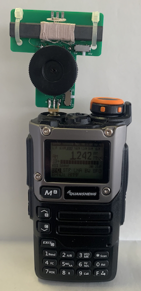  
装着し，1242kHzを受信している状態   

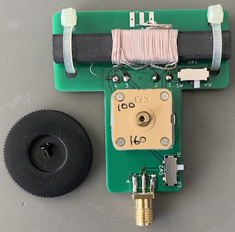  
部品をつけた基板  

バーアンテナにST55GT（例えばサトー電気）を使い，バリコンにXK444CA-4CA （例えばaitendo）を使用しています．  
SW1では，バリコンの接続容量を変えています．  
MW側で最大で100pF+160pF=260pFになり，中波放送帯がカバーできます．  
SW側にすると最大40pFのバリコンになって，1.5MHzから2.1MHzぐらいが同調可能になります．  
バリコンの後ろのトリマーコンデンサーは容量が最小になるように調整しておいてください．  
中波放送受信で十分な場合，下図のようにスイッチをつけずに，ジャンパー接続します．  
SW2はバーアンテナと受信機の接続方法を変えています．  
UV-K5に接続して実際に受信した結果，SW2でバーアンテナの１次側に設定した場合は感度が悪く受信できず，バーアンテナの２次側接続で受信できました．  
このため，SW2を使用せず，下図の赤線のジャンパー接続がおすすめです．  

  
SWを使用しない場合のジャンパー(赤線)  

UV-K5との接続に，今回はSMA-J（メス）のエッジコネクタを使用しましたが，SMA-P（オス）のエッジコネクタをつけた方が良いと思います．  
この場合，UV-K5との接続にはSMA-J⇔SMA-J中継コネクタを使用する必要がありますが，UV-K5本体とバーアンテナの向きを自由に決められます．  
また，SMA-P（オス）のエッジコネクタをつけると，アップコンバータにも直接接続できます．  

#### JLCPCB用のガーバーファイルは"bar_antenna_gerber.zip"です．  

#### 必要部品(2024年5月1日時点)  
	バーアンテナ　ST55GT： 1個　たとえばサトー電気 121円　http://www.maroon.dti.ne.jp/satodenki/l.html#ant_ift
	バリコン　XK444CA-4CA： 1個　たとえばaitendo 300円　https://www.aitendo.com/product/20362  (ダイヤルも購入しました)
	スライドスイッチ　IS-1245T-G： 必要ならば 秋月電子 1個25円　https://akizukidenshi.com/catalog/g/g115368/
	SMAエッジコネクタ：　SMA-P（オス）のエッジコネクタ + SMA-J⇔SMA-J中継コネクタ がおすすめ
 	結束バンド

##  MLA-1

Si4732置換キットを使用した改造を行なったUV-K5やアップコンバーターをつけたUV-K5で短波放送を聴く場合，外部アンテナが必要です．  
ロッドアンテナでは，特に低周波数領域で受信感度が低いので，マグネチックループアンテナ(MLA)を製作しました．  
3Ｄ無線クラブの”56、BCL 中波帯対応受信用 マグネチック・ループアンテナの作り方”https://www.ddd-daishin.co.jp/ddd/56-loopant-bcl/
を参考にしました．  
短波帯で気軽に使えるように上記記事よりも小型のループにし，バリコンによる同調型にしてSN比が上がるようにしました．  

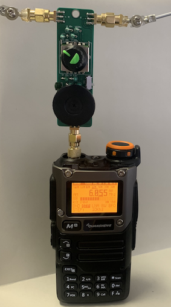  
円周1mの2mmφアルミニウム線ループアンテナを装着し，6055kHz(ラジオNIKKEI)を受信している様子   
テスト時は磁気嵐の関係なのか受信感度は悪く，S8で37dBuVですが，下図に示すように同時刻に約50cmのロッドアンテナでは全く受信できませんでした．   
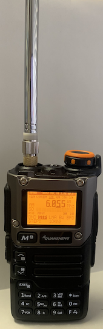  
約50cmのロッドアンテナを装着し，6055kHz(ラジオNIKKEI)を受信している様子(全く受信できていない．)

状態の良い時に受信した結果は，下記に示しています．

回路図は，
    
  
J1とJ3の間に繋いだアンテナループがインダクタとなり，バリコンとで直列共振回路を形成します．  
受信機への出力は，基本的に1800pFのコンデンサの両端から信号を取っています．  
ロータリースイッチによって直列接続するインダクタンスを変えることで低周波のバンドにも切り替え可能で，最終的にバリコンでチューニングします．  
バリコンにXK444CA-4CA（aitendo）を使用した場合，2個のAM用バリコンの並列接続で32pFから260pFまでぐらいで変化できそうです．  
（バリコンの各トリマコンデンサは容量が最小になるように調整しておいてください．）  
以下のサイトの計算から，ループアンテナのおおよそのインダクタンスを計算できます．  
https://jun930.hatenablog.com/entry/2019/06/15/121133  
1mのループの場合，インダクタンスは約1uHになり，追加インダクタンスなしで32pF-260pFのバリコンで26MHz-9MHz程度で同調しそうです．  
30cmのループは0.3uH程度になると考えられるので，53MHz-18MHz程度になりそうです．  
一方，オリジナルと同様に静電シールド効果を期待してエレメントに同軸ケーブルを使用した場合，ケーブルの静電容量が並列接続されます．  
50オームの同軸ケーブルを使用した場合．太さによらず長さ1cmでほぼ1pFが加算されます．  
30cmの同軸ケーブルの場合には38MHz-18MHz，1mの同軸ケーブルの場合12MHz-7MHz程度で同調すると考えられます．  
   
直列インダクタンスを追加することで，以下の表のような範囲で同調できると考えられます．
   
同調可能周波数範囲の目安のテーブルです．  
   
4連ポリバリコンの中で使用するバリコンの組み合わせは，ジャンパーパッドの切断・接続で変えることが可能です．  
現在は２つのAM用のバリコンを並列接続で使っています．  
実際に試したところ，ほぼ表の範囲で同調でき，同調時に信号が浮かび上がって聞こえました．  
非同調時には信号は聞こえません．  
チューニングは少々クリティカルです．  
30cmの同軸ケーブルループを使用した場合，約50cmのロッドアンテナと比較すると少なくとも10MHz以下での感度は優っているようでした．  
6.055MHzのラジオNIKKEIを受信した場合，50cmのロッドアンテナでS6，33dBuVの時，30cmの同軸ケーブルループではS9で42dBuVでした．  
一方，10MHz以上では，約50cmのロッドアンテナの方が感度は良さそうでした．  
ただ，14.074MHz,21.074MHzのFT8信号を聞いたところでは，同調した30cm同軸ケーブルループの方がSN比は良いように感じました．  
28.074MHzもSN比は遜色ないように思われました．  
後述の全コンデンサの両端から信号を取り出した場合，28.074MHzでも50cmのロッドアンテナとほぼ同じ感度でした．  
約12MHz以下でのみ使用可能な1mの同軸ケーブルループですが，受信感度は30cm同軸ケーブルのものよりも高くなっていました．  
6.055MHzのラジオNIKKEIの受信強度は，30cmの同軸ケーブルループがS9で42dBuVの時，1mの同軸ケーブルループ(2重巻)ではS9+で60dBuVでした．  
1mの同軸ケーブルループ(2重巻)で中波放送の受信も可能でしたが，感度はバーアンテナに劣りました．  
1242kHzのニッポン放送を受信した場合，バーアンテナがS9+で52dBuVの時，1mの同軸ケーブルループ(2重巻)はS9で42dBuVでした．   

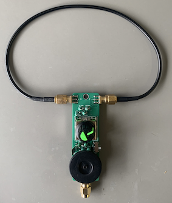   
30cm同軸ケーブルループアンテナ．　両端SMA-P（オス）の同軸ケーブルがそのまま使用できます．   

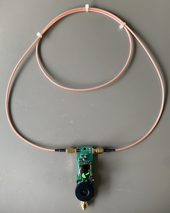   
1m同軸ケーブルループアンテナ．　両端SMA-P（オス）の同軸ケーブルがそのまま使用できます．   
1m同軸ケーブルは一巻きでは自立しなかったので変形2重巻きにしました．   
2重巻きでインダクタンスはほとんど変わりませんが，感度は少し落ちると思います．   

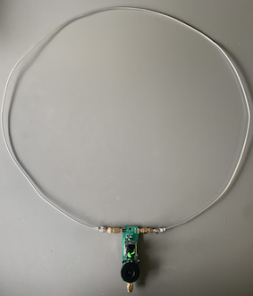   
1mアルミニウム線ループエレメント．　素線はDaisoのアルミ自在ワイヤー(2.0mm)を使用しました．   
SMA-P（オス）のエッジコネクタに圧着端子R0.3-3をつけました．   
アルミ自在ワイヤー(2.0mm)の両端には圧着端子Y2-3をつけています．   
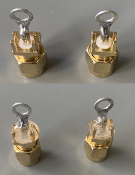   
はんだ付け後，エポキシ系接着剤（2液混合型）で固定  
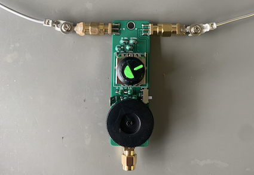   

バリコンに直列接続した1800pFのコンデンサの両端から信号を取り出しているため，同調時のバリコンの静電容量で受信感度が変化します．   
バリコンを抜いた位置で信号強度が下がり，特に10MHz以上では顕著に感度が下がります．   
一方，全コンデンサの両端から信号を取り出すと感度は稼げますが，選択度が低下します．   
特に低周波数領域では，選択度はほとんどなくなりました．   
SW1はその切り替えスイッチですので，使用状況に合わせて切り替えます．   
高周波数領域はロッドアンテナを使用することにして，低周波領域での使用に割り切って，ジャンパーにするのもありだと思います．   

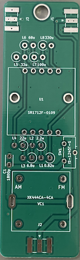  
基板（表）

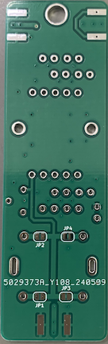  
基板（裏）

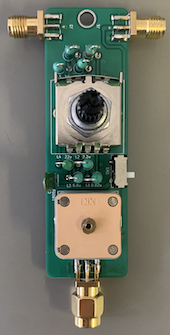  
部品をつけた基板  
バリコンの取り付け前に，各トリマコンデンサは容量が最小になるように調整しておいてください．

UV-K5との接続に，今回はSMA-P（オス）のエッジコネクタを使用しました．   
その場合，UV-K5との接続にはSMA-J⇔SMA-J中継コネクタを使用します．  
また，アップコンバータにも直接接続できます．  

#### JLCPCB用のガーバーファイルは"MLA1_gerber.zip"です．  

#### 必要部品(2024年5月16日時点)  
	バリコン　XK444CA-4CA： aitendo 1個300円　https://www.aitendo.com/product/20362  (ダイヤルも合わせて購入しました)
				aitendo 444HF-4CB 1個300円　https://www.aitendo.com/product/12001も使えそうな気がします．
				amazonなどで売っているポリバリコンもジャンパーを変えれば使えるかもしれません．
	ロータリースイッチ　SR1712F-0109： 秋月電子 1個240円　https://akizukidenshi.com/catalog/g/g116036/
	マイクロインダクタ　0.82uH: たとえば サトー電気 (1.0uH 秋月電子でも大丈夫かもしれません)
	マイクロインダクタ　2.2uH: たとえば サトー電気，秋月電子
	マイクロインダクタ　6.8uH: たとえば 秋月電子
	マイクロインダクタ　22uH: たとえば サトー電気，秋月電子
	マイクロインダクタ　33uH: たとえば サトー電気，秋月電子
	マイクロインダクタ　68uHH: たとえば サトー電気，秋月電子
	マイクロインダクタ　100uH: たとえば サトー電気，秋月電子
	マイクロインダクタ　330uH: たとえば サトー電気，秋月電子
	SMAエッジコネクタ：　SMA-P（オス）のエッジコネクタ　1個， SMA-J（メス）のエッジコネクタ　2個
	スライドスイッチ　IS-1245T-G： 1個　秋月電子 25円　https://akizukidenshi.com/catalog/g/g115368/
 	アンテナエレメント：　SMA-P付きケーブル1mあるいは30cmなど, もしくは金属線(長さは感度と周波数の兼ね合いなどで決定)

##  MLA-2

MLA-1の高周波数領域の選択度の改良版です．  

回路図は，
    
  
基本的にMLA-1と同じですが，受信機への出力方法を少し変更しています．  
低周波数側はMLA-1と同じで，1800pFのコンデンサの両端から出力信号を取っています．  
高周波数側は，トロイダルコアを使用したトランスで出力信号を取れるようにしました．  
トロイダルコアにFT23-43を使用し，アンテナ側は1ターン，2次側は20ターンとしました．  
全コンデンサの両端から信号を取り出すよりも選択度は上昇しました．感度は同程度でした．  
トロイダルコアを使用したトランスを出力として使用した場合，低周波数領域で感度が低下します．  
一方，1800pFのコンデンサの両端から出力をとった場合，高周波数領域で感度が低下します．  
SW1はその切り替えスイッチですので，高周波数領域では主にトランス側，低周波数領域では主にコンデンサ側に切り替えて使用します．   

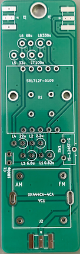  
基板(表)

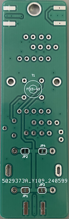  
基板(裏)

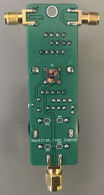  
部品をつけた基板の裏側　　
トロイダルコアのトランスはロータリースイッチを取り付ける前につけます．   
バリコンの取り付け前に，各トリマコンデンサは容量が最小になるように調整しておいてください．
表側の見た目はMLA-1と同じです．   

#### JLCPCB用のガーバーファイルは"MLA2_gerber.zip"です．  

#### 必要部品(2024年5月16日時点)  
	MLA-1の部品に加えて
	トロイダルコア　FT23-43： たとえば共立エレショップ 1個176円　https://eleshop.jp/shop/g/gF9U121/

 
## LNA

今回作製したMLAは選択度が高く，受信時のSN比が良いので，プリアンプが有効だと思われます．  
特に小さいループ長のMLAをSi4732改造UV-K5で使用する時に感度が少し不足気味だと感じることがありました．  
そこで，Liイオン電池を内蔵した30MHz以下で作動するプリアンプを製作しました．  
これを接続することで，6055kHzのラジオNIKKEIの受信強度が，1mループアンテナでS8の37dBuVだったのがS9+の47dBuVとなりました．  
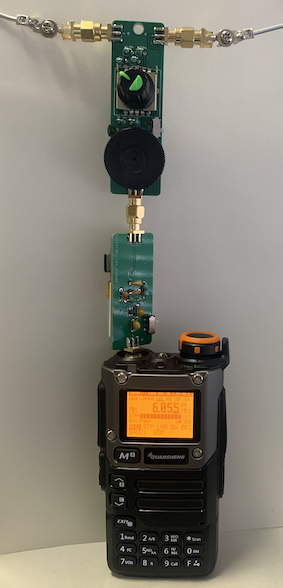  
また，30cm同軸ケーブルループアンテナでも中波放送の受信が可能でした．  

回路図は，

です．　　　

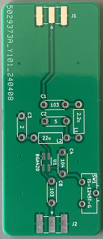  
基板(表)   

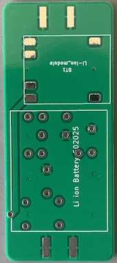  
基板(裏)   

  
部品をつけた基板(表)   

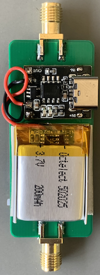  
部品をつけた基板(裏)   
	
#### JLCPCB用のガーバーファイルは"LNA_gerber.zip"です．  

#### 必要部品(2024年5月16日時点)  
	BGA420： 1個　たとえば秋月電子 120円　https://akizukidenshi.com/catalog/g/g113865/
	スライドスイッチ　IS-1245T-G： 1個　秋月電子 25円　https://akizukidenshi.com/catalog/g/g115368/
	SMAコネクタ（エッジマウント）： 2個　たとえば秋月電子 150円　https://akizukidenshi.com/catalog/g/g116928/
	マイクロインダクター22uH： たとえば秋月電子 10本70円　https://akizukidenshi.com/catalog/g/g103964/
	マイクロインダクター2.2uH： たとえば秋月電子 10本70円　https://akizukidenshi.com/catalog/g/g115185/
	(積層)セラミックコンデンサー5pF： 1個
	(積層)セラミックコンデンサー2pF： 1個
	積層セラミックコンデンサー103： 2個
	積層セラミックコンデンサー104： 1個
	Liイオン電池：例えば 502025 3.7V 200mAh Amazon 2個で1299円
	Liイオン電池充電器：例えば AliExpress 1個40円 https://ja.aliexpress.com/item/1005006241591318.html 
