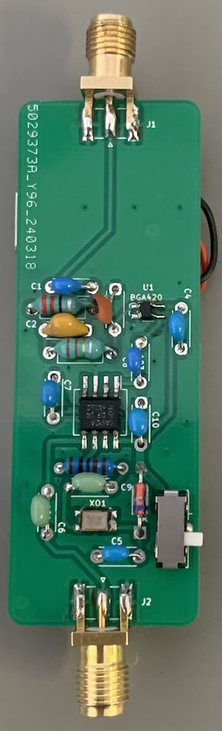
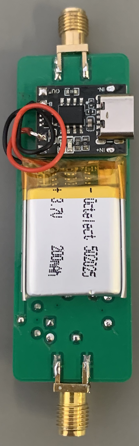
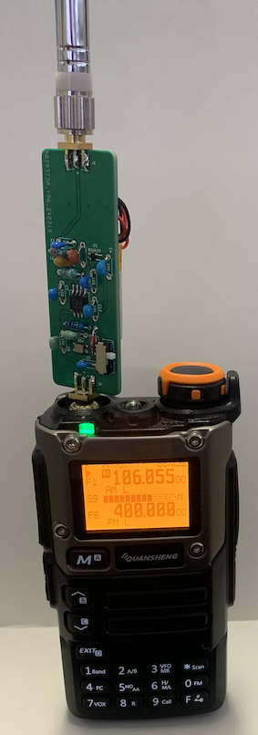

# UV-K5_upconverter
UV-K5のHF広帯域受信機化改造は，同機のファームウェア変更やハードウェア改造などが行われています．  
現時点(2024/3/28)では，ファームウェア変更により15MHz以上の周波数でSSBの受信が可能となっています．  
UV-K5のFM放送受信用のSDR用ICをSi4732に置換して，HF全領域の受信を可能とする改造もあります．  
AliExpressでは，その改造用部品のキットも販売されています．  

一方，安価なrtl-sdrドングルが流行った頃，初期の段階では30MHz以下では使えなかったため，HF周波数を100MHz程度に周波数変換するアップコンバーターがありました．  
その後，RTL2832Uのダイレクトサンプリングなどの開発により廃れてしまいましたが，今でもアップコンバーターはAmazonやAliExpressなどで見かけます．  
そこで，UV-K5にもアップコンバーターを付けることでHF帯の受信を可能にすることを考えました．  
そうすると．本体の分解なしでHF広帯域受信機化ができます．  

局所発振周波数をF0とすると，周波数fの信号はF0±f (F0>fの時）に変換されます．  
例えば局所発振周波数100MHzで，7MHzのAM信号は107MHzと93MHzに変換され，UV-K5ではどちらの周波数でも受信可能です．  
SSBの場合には，　F0+fに変換された信号の側波帯の符号はそのまま保持され，USBはUSBで，LSBはLSBで復調できます．  
一方，F0-fに変換された信号の場合は，符号が逆転しますので，USBはLSBに，LSBはUSBになります．  
UV-K5のSSBモードは、USBの受信に対応していますので，7MHz帯のUSBを受信したい場合(FT8など)は107MHzで受信する必要があります．  
一方，7MHz帯では音声通信はLSBを使っていますので，例えば7.1MHzの音声信号を受信したい場合，F0-fの92．9MHzで受信すれば，復調できます．  

現在購入できるアップコンバーターは外部電源が必要なものしか見つけられなかったので，電池を内蔵してUV-K5とロッドアンテナで使えるようにすることにしました．  

最終的に，製作の手間を考えるとAliExpressのSi4732への改造キットを購入して改造する方が良いかも知れません．  
私もAliExpressのキットを購入して改造しましたが，このアップコンバーターを作るよりも安価で，製作・改造も簡単なような気がします．  
一応．最終的な感度は，tinySAから信号を入れて耳で比べた結果，AliExpressのSi4732キットと同程度でした．  
ロッドアンテナを使って6.055MHzのラジオNIKKEIを受信した場合の感度ではこちらの方が少し優っているかもしれません．  
せっかく作ったので，製作のメモとしてアップします．  

具体的な製作は以下のとおりです．  
### 1．SA612(DBM IC)によるアップコンバージョン
	局所発振器100MHzを使用し，受信信号f(MHz)をアップコンバーションします． 
	このため，受信機本体の周波数設定は100+f(MHz)もしくは100-f(MHz)となります． 
	SSBの場合，例えば7MHzのLSBシグナルは，93MHzのUSBで受信できます． 
	また，7MHzのUSBシグナルは，107MHzのUSBで受信できます． 
	100MHzの水晶発振子はなかなか見かけないのですが，100MHzの水晶発振器はAliExpressで安く購入できますのでそれを使用しました．
	3.3V,100MHzの発振器の信号を100pFと1kΩを介してSA612に導入しています．  
	水晶発振器とSA612は表面実装部品です．  

### 2．ローパスフィルタとRFアンプ  
	ロッドアンテナでの受信を想定するとRFアンプが必要です．  
	SA612の表面実装部品を使っているので，RFアンプも回路が簡単になる表面実装ICのBGA420を使いました．  
	アップコンバータで使用するには，入力にLPFが必要です．  
	15MHz以上はオリジナルのハードウェアで受信可能なので，カットオフ周波数は20MHzぐらいにしました．  

### 3．電源 
	SA612の電源電圧は4.5Vから8.0Vとされていますが，3.7Vでの使用例もあるのでLiイオン電池を使うことにしました．
	BGA420は3Vから5Vでの作動ですから問題ありません．
	3.3Vの水晶発振器には少し電圧が高いので，シリコンダイオードの順方向電圧降下を利用することにしました．
	Li電池はAmazonで売っている502025型を使用しました．
 	充電器はAliExpressに小型のモジュールがあったので，それを使用しました．

回路図は，
     

  
部品をつけた基板(表)   
SA612と水晶発振器は文字が下向きになるように付けます．
BGA420はGNDピンの幅が広いので，ICの向きがわかります．   

  
部品をつけた基板(裏)   
Liイオン電池と充電モジュール．  

  
ロッドアンテナでラジオNIKKEI(6055kHZ)を受信している様子．

#### JLCPCB用のガーバーファイルは"UV-K5_upconv_gerber.zip"で，Kicadのファイルは"UV-K5_upconv_kicad.zip"です．  

#### 必要部品(2024年3月28日時点)  
	SA612： 1個　たとえば秋月電子 370円　https://akizukidenshi.com/catalog/g/g113622/
	BGA420： 1個　たとえば秋月電子 120円　https://akizukidenshi.com/catalog/g/g113865/
	水晶発振器 3.3V 100MHz　3225： 1個　たとえばAli 5個で442円　https://ja.aliexpress.com/item/1005003211256112.html
	シリコンダイオード　： 1個　
	スライドスイッチ　IS-1245T-G： 1個　秋月電子 25円　https://akizukidenshi.com/catalog/g/g115368/
	SMAコネクタ（エッジマウント）： 2個　たとえば秋月電子 150円　https://akizukidenshi.com/catalog/g/g116928/
	マイクロインダクター22uH： たとえば秋月電子 10本70円　https://akizukidenshi.com/catalog/g/g103964/
	マイクロインダクター2.2uH： たとえば秋月電子 10本70円　https://akizukidenshi.com/catalog/g/g115185/
	(積層)セラミックコンデンサー5pF： 1個
	(積層)セラミックコンデンサー2pF： 1個
	(積層)セラミックコンデンサー101： 2個
	積層セラミックコンデンサー103： 3個
	積層セラミックコンデンサー104： 3個
	抵抗　1KΩ：1個  
	Liイオン電池：例えば 502025 3.7V 200mAh Amazon 2個で1299円
	Liイオン電池充電器：例えば Aliexpress 1個40円 https://ja.aliexpress.com/item/1005006241591318.html 
